# MXCP Project Deployment Template

This repository provides standardized deployment infrastructure for MXCP projects, enabling consistent CI/CD and deployment patterns across all RAW Labs MXCP implementations.

## Architecture Overview

```mermaid
graph TB
    %% GitHub Workflows
    subgraph "🚀 GitHub Workflows (.github/)"
        Deploy[".github/workflows/deploy.yml<br/>📋 Main CI/CD Pipeline"]
        Test[".github/workflows/test.yml<br/>🧪 PR Testing"]
        Release[".github/workflows/release.yml<br/>🏷️ Release Management"]
    end

    %% Justfile Tasks
    subgraph "⚡ Justfile Tasks (justfile)"
        ValidateConfig["just validate-config<br/>📝 YAML validation"]
        CiTests["just ci-tests-with-data<br/>🔍 CI tests + data"]
        FullPipeline["just full-pipeline<br/>🏗️ Complete dev pipeline"]
        TestIntegration["just test-integration<br/>🔧 Integration tests"]
        PrepareBuild["just prepare-build<br/>📦 Data preparation"]
        TestData["just test-data<br/>🧪 Level 1: dbt tests"]
        TestEvals["just test-evals<br/>🤖 Level 3: LLM evals"]
    end

    %% Deployment Files
    subgraph "🐳 Deployment (deployment/)"
        Dockerfile["Dockerfile<br/>🐳 Container build"]
        ConfigEnv["config.env.template<br/>⚙️ AWS configuration"]
        MxcpSite["mxcp-site-docker.yml.template<br/>🔧 MXCP config"]
        UserConfig["mxcp-user-config.yml.template<br/>🔐 Secrets & LLM keys"]
        StartSh["start.sh<br/>🚀 Container startup"]
    end

    %% Project Files
    subgraph "📁 Project Structure"
        Scripts["scripts/<br/>📜 Data download logic"]
        Tools["tools/<br/>🛠️ MXCP endpoints"]
        Models["models/<br/>📊 dbt transformations"]
    end

    %% Workflow Relationships
    Deploy -->|"1. Validation"| CiTests
    Deploy -->|"Fallback"| ValidateConfig
    Deploy -->|"2. Post-deployment"| TestIntegration
    
    Test -->|"PR Testing"| FullPipeline
    Test -->|"Fallback"| ValidateConfig

    %% Justfile Task Dependencies
    CiTests --> ValidateConfig
    CiTests --> PrepareBuild
    CiTests --> TestData
    
    FullPipeline --> PrepareBuild
    FullPipeline --> TestData
    FullPipeline --> TestIntegration
    
    TestIntegration -->|"Uses"| Tools
    TestData -->|"Tests"| Models

    %% Docker Build Process
    Dockerfile -->|"Installs just"| PrepareBuild
    PrepareBuild -->|"Downloads data"| Scripts
    PrepareBuild -->|"Runs dbt"| Models

    %% Configuration Flow
    ConfigEnv -->|"AWS settings"| Deploy
    MxcpSite -->|"MXCP config"| Dockerfile
    UserConfig -->|"Secrets"| Dockerfile

    %% 3-Tiered Testing
    subgraph "🎯 3-Tiered Testing"
        Level1["Level 1: Data Quality<br/>🧪 dbt schema tests<br/>💰 Free"]
        Level2["Level 2: Integration<br/>🔧 MXCP tools tests<br/>💰 Free"]
        Level3["Level 3: LLM Evaluation<br/>🤖 AI behavior tests<br/>💰 Costs Apply"]
    end

    TestData -.->|"Implements"| Level1
    TestIntegration -.->|"Implements"| Level2
    TestEvals -.->|"Implements"| Level3

    %% Styling
    classDef workflow fill:#e1f5fe,stroke:#01579b,stroke-width:2px
    classDef justfile fill:#f3e5f5,stroke:#4a148c,stroke-width:2px
    classDef deployment fill:#e8f5e8,stroke:#1b5e20,stroke-width:2px
    classDef project fill:#fff3e0,stroke:#e65100,stroke-width:2px
    classDef testing fill:#fce4ec,stroke:#880e4f,stroke-width:2px

    class Deploy,Test,Release workflow
    class ValidateConfig,CiTests,FullPipeline,TestIntegration,PrepareBuild,TestData,TestEvals justfile
    class Dockerfile,ConfigEnv,MxcpSite,UserConfig,StartSh deployment
    class Scripts,Tools,Models project
    class Level1,Level2,Level3 testing
```



### Understanding the Architecture

The diagram above shows how the template's components work together:

**🔄 Workflow Execution Flow:**
1. **GitHub Workflows** trigger **Justfile tasks** for consistent execution
2. **Justfile tasks** orchestrate the **3-tiered testing** approach
3. **Deployment files** configure the containerized environment
4. **Project files** contain your specific MXCP implementation

**🎯 Key Integration Points:**
- **Workflows → Justfile**: All CI/CD uses justfile tasks (no manual commands)
- **Justfile → Project**: Tasks operate on your scripts, models, and tools
- **Docker → Justfile**: Container build uses `just prepare-build` for data prep
- **Config → All**: Template files provide consistent configuration patterns

**💡 Benefits:**
- **Consistency**: Same tasks run locally and in CI/CD
- **Flexibility**: Graceful fallbacks for different project types
- **Maintainability**: Centralized task definitions in justfile
- **Testability**: 3-tiered approach from config validation to LLM evaluation

## Purpose

**Template Architecture Benefits:**
- **Standardized CI/CD** - Same deployment logic across all MXCP projects
- **Easy Squirro collaboration** - Clear separation between stable templates and customizable configuration
- **Proven patterns** - Based on successful production deployments
- **Minimal merge conflicts** - Template files rarely change

## Template Components

### Stable Components (.github/)
**Never modified by project teams:**
- `workflows/deploy.yml` - Generic CI/CD pipeline for AWS App Runner
- `workflows/test.yml` - Standardized testing workflow
- `scripts/deploy-app-runner.sh` - App Runner deployment logic
- `workflows/release.yml` - Release management

### Customizable Components (deployment/)
**Modified for each project:**
- `config.env.template` - AWS account, ECR repository, service names
- `mxcp-site-docker.yml.template` - MXCP configuration with project name
- `profiles-docker.yml.template` - dbt profiles with project name
- `mxcp-user-config.yml.template` - MXCP user config with LLM API keys and generic secrets
- `Dockerfile` - Generic container build pattern
- `start.sh` - Generic container startup script
- `requirements.txt` - Base MXCP dependencies

## Prerequisites

### AWS Setup
1. **AWS Account** with App Runner service access
2. **IAM Role**: `AppRunnerECRAccessRole` with ECR access permissions
3. **Repository Secrets** in GitHub:
   - `AWS_ACCESS_KEY_ID` - For deployment access
   - `AWS_SECRET_ACCESS_KEY` - For deployment access
   - `MXCP_DATA_ACCESS_KEY_ID` - For data download (if needed)
   - `MXCP_DATA_SECRET_ACCESS_KEY` - For data download (if needed)
   - `OPENAI_API_KEY` - For LLM functionality (optional)
   - `ANTHROPIC_API_KEY` - For Claude models (optional)

### Required Tools
- **Git** - For repository management
- **Docker** - For local testing (optional)
- **just** - Modern task runner (optional but recommended)

## Usage

### For New MXCP Projects

#### Quick Setup (Automated)

```bash
# Copy template to your project
cp -r /path/to/mxcp-project-deployment-template your-new-project/
cd your-new-project

# Run automated setup (steps 2-4)
./setup-project.sh your-project-name [aws-region]

# Example:
./setup-project.sh finance-demo
./setup-project.sh uae-licenses us-west-2
```

#### Manual Setup (Step by Step)

**1. Copy Template Components**
```bash
# Copy the stable and customizable directories to your new project
cp -r /path/to/mxcp-project-deployment-template/.github your-new-project/
cp -r /path/to/mxcp-project-deployment-template/deployment your-new-project/
```

**2. Customize Configuration**
```bash
cd your-new-project

# Customize deployment configuration
cp deployment/config.env.template deployment/config.env
vim deployment/config.env

# Set your values:
# AWS_ACCOUNT_ID=your-aws-account
# AWS_REGION=your-region  
# ECR_REPOSITORY=your-project-mxcp-server
# APP_RUNNER_SERVICE=your-project-mxcp-server
```

**3. Setup Task Runner (Optional but Recommended)**
```bash
# Copy and customize the modern task runner
cp justfile.template justfile

# Customize placeholders for your project (see Justfile Guide below)
sed -i "s/{{PROJECT_NAME}}/your-project/g" justfile
# Add your specific data download and dbt commands...

# Install just (if not already installed)
curl --proto '=https' --tlsv1.2 -sSf https://just.systems/install.sh | bash -s -- --to ~/.local/bin
```

**4. Customize Docker Configuration**
```bash
# Update MXCP configuration
cp deployment/mxcp-site-docker.yml.template deployment/mxcp-site-docker.yml
sed -i "s/{{PROJECT_NAME}}/your-project/g" deployment/mxcp-site-docker.yml

# Update dbt profiles
cp deployment/profiles-docker.yml.template deployment/profiles-docker.yml
sed -i "s/{{PROJECT_NAME}}/your-project/g; s/{{AWS_REGION}}/your-region/g" deployment/profiles-docker.yml
```

**5. Initialize MXCP Project Structure**
```bash
# Initialize MXCP project with example endpoints
mxcp init --bootstrap

# This creates:
# - mxcp-site.yml (main configuration)
# - tools/ directory with example endpoints
# - Basic project structure
```

**6. Choose Your Data Strategy**

The template supports three data patterns:

**Option A: Static Data (simplest)**
```bash
# Place your data files in data/ directory
mkdir -p data/
# Copy your CSV/JSON files here
# Modify Dockerfile to skip download step
```

**Option B: Downloaded Data**
```bash
# Create data download script (customize for your source)
mkdir -p scripts/
# Create scripts/download_real_data.py for your data source (S3, API, etc.)
# Docker will run this during build
```

**Option C: Live API Integration**
```bash
# No data download needed - your tools connect to live APIs
# Remove data download from Dockerfile
# Configure API endpoints in your tools/
```

**7. Deploy**
```bash
# Set GitHub repository secrets (AWS_ACCESS_KEY_ID, AWS_SECRET_ACCESS_KEY)
# Push to trigger automatic deployment
git push origin main
```

## Template Philosophy

- **`.github/` = STABLE** - Rarely changes, provides consistent CI/CD
- **`.squirro/` = SQUIRRO-SPECIFIC** - Tools and workflows for Squirro integration
- **`deployment/` = CUSTOMIZABLE** - Projects modify configuration files
- **`justfile.template` = GENERIC** - Uses placeholders for project-specific commands:
  - `{{DATA_DOWNLOAD_COMMAND}}` - How to download your project's data
  - `{{DBT_RUN_COMMAND}}` - How to run dbt with your data variables
  - `{{DBT_TEST_COMMAND}}` - How to test dbt with your data variables
- **Clear separation** - Teams know exactly what to customize vs what to keep

## Justfile Guide

The template includes a modern task runner (`justfile.template`) that provides a standardized way to run common MXCP operations. This replaces scattered shell scripts with clean, documented tasks.

### 3-Tiered Testing Architecture

The justfile implements a comprehensive testing strategy with three levels:

| Level | Type | Purpose | Cost | Command |
|-------|------|---------|------|---------|
| **Level 1** | Data Quality | dbt schema tests, referential integrity | Free | `just test-data` |
| **Level 2** | Integration | MXCP tools functionality, API endpoints | Free | `just test-integration` |
| **Level 3** | LLM Evaluation | End-to-end AI behavior validation | $$$ | `just test-evals` |

### Template Placeholders

When customizing `justfile.template`, replace these placeholders with your project-specific commands:

#### **{{PROJECT_NAME}}** 
Replace with your project name (e.g., "uae-licenses", "finance-demo"):
```bash
sed -i "s/{{PROJECT_NAME}}/your-project/g" justfile
```

#### **{{DATA_DOWNLOAD_COMMAND}}**
Replace with your data download command:

**Example (S3 download):**
```bash
python3 scripts/download_real_data.py --output data/licenses.csv
```

**Example (API fetch):**
```bash
python3 scripts/fetch_from_api.py --output data/records.csv
```

**Example (Static data):**
```bash
echo "Using static data - no download needed"
```

#### **{{DBT_RUN_COMMAND}}**
Replace with your dbt run command:

**Example (with variables):**
```bash
dbt run --vars '{"licenses_file": "data/licenses.csv"}'
```

**Example (simple):**
```bash
dbt run
```

#### **{{DBT_TEST_COMMAND}}**
Replace with your dbt test command:

**Example (with variables):**
```bash
dbt test --vars '{"licenses_file": "data/licenses.csv"}'
```

**Example (simple):**
```bash
dbt test
```

#### **{{MXCP_EVALS_COMMANDS}}**
Replace with your MXCP evaluation commands:

**Example (multiple evals):**
```bash
mxcp evals basic_test
mxcp evals search_functionality
mxcp evals aggregation_analysis
mxcp evals geographic_analysis
mxcp evals timeseries_analysis
mxcp evals edge_cases
```

**Example (single eval):**
```bash
mxcp evals my_project_basic
```

### UAE MXCP Server Example

Here's how the UAE project customized the template:

```bash
# UAE-specific customization
PROJECT_NAME="uae-licenses"
DATA_DOWNLOAD_COMMAND="python3 scripts/download_real_data.py --output data/licenses.csv"
DBT_RUN_COMMAND='dbt run --vars '"'"'{"licenses_file": "data/licenses.csv"}'"'"''
DBT_TEST_COMMAND='dbt test --vars '"'"'{"licenses_file": "data/licenses.csv"}'"'"''
MXCP_EVALS_COMMANDS="mxcp evals basic_test\n    mxcp evals search_functionality\n    mxcp evals aggregation_analysis\n    mxcp evals geographic_analysis\n    mxcp evals timeseries_analysis\n    mxcp evals edge_cases"
```

### Available Tasks

After customization, your justfile will provide these tasks:

#### **Data Pipeline Tasks**
- `just download` - Download/prepare your project data
- `just build-models` - Run dbt transformations  
- `just prepare-build` - Complete data preparation for Docker

#### **Testing Tasks (3-Tier)**
- `just test-config` - Validate YAML configurations (instant)
- `just test-data` - Run dbt data quality tests (Level 1)
- `just test-integration` - Test MXCP tools functionality (Level 2) 
- `just test-evals` - Run LLM evaluation tests (Level 3, costs apply)
- `just test-all` - Run all three testing levels

#### **Development Workflows**
- `just dev` - Standard development pipeline (Levels 1+2, free)
- `just dev-full` - Full development pipeline (Levels 1+2+3, costs apply)
- `just full-pipeline` - Complete ETL + testing pipeline
- `just ci-tests-with-data` - CI-ready tests with data download

#### **Utility Tasks**
- `just validate-config` - Quick YAML validation (no data needed)
- `just` or `just --list` - Show all available tasks

### Usage Examples

```bash
# Quick development cycle (free)
just dev                    # Download data + build + test Levels 1+2

# Full validation before release (costs apply)  
just dev-full              # Download data + build + test all 3 levels

# Individual testing levels
just test-data             # Level 1: dbt schema tests
just test-integration      # Level 2: MXCP tools tests  
just test-evals           # Level 3: LLM evaluation tests (requires OPENAI_API_KEY)

# CI/CD pipeline
just ci-tests-with-data    # Standard CI tests with data
```

### Cost Management

**Level 3 (LLM Evaluation) costs apply:**
- Requires `OPENAI_API_KEY` environment variable
- Each eval run costs ~$0.10-$2.00 depending on complexity
- Use `just test-evals` sparingly (before releases, not every commit)
- Use `just dev` for daily development (excludes Level 3)

## Examples

### Successful Implementation
- **UAE Business Licenses**: https://github.com/raw-labs/uae-mxcp-server
- **Live Service**: https://sqt3yghjpw.eu-west-1.awsapprunner.com
- **Records**: 3,186,320 UAE business licenses
- **Configuration**: 4 vCPU, 8GB memory

### Template Benefits Proven
- **Zero merge conflicts** during RAW-Squirro collaboration
- **Consistent deployment** across all MXCP projects  
- **Easy customization** - Only edit deployment/config.env
- **Automatic CI/CD** - Works out of the box

## Support

For questions about using this template:
- **Technical**: Pavlos Polydoras (pavlos@raw-labs.com)
- **Integration**: RAW Labs Support
- **Documentation**: https://github.com/raw-labs/mxcp-squirro-devops-integration-guide
