# MXCP Project Deployment Template

> 🚀 **Stop wasting days on deployment setup. This battle-tested template gives any MXCP project production-ready CI/CD in 5 minutes.**

## 🎯 Why This Template?

### Problems We're Solving

**Without this template, every MXCP project faces:**

🔄 **Deployment Drift**
- Each project reinvents CI/CD from scratch
- No consistency between projects (UAE uses one approach, Vertec another)
- Knowledge isn't transferable between teams

⏰ **Time Waste**  
- 1 full day to set up deployment per project
- Debugging the same issues repeatedly
- Manual, error-prone deployment processes

🔐 **Security Risks**
- Secrets accidentally baked into Docker images
- API keys exposed in build logs
- No standardized secret management

🚨 **Production Incidents**
- "Works on my machine" syndrome
- Missing environment variables in production
- No standardized health checks or monitoring

### The Solution

**One template, infinite projects:**
- **5 minutes** to full CI/CD (vs 1 day)
- **Zero secrets** in Docker images
- **4-tiered testing** catches issues early (data → tools → API → LLM)
- **Battle-tested** in production

## 🏆 Quick Wins

Using this template immediately gives you:
- ✅ Automated deployment to AWS App Runner on every push
- ✅ Secure secret management (no more hardcoded API keys)
- ✅ 4-tiered testing (data → tools → API → LLM)
- ✅ Basic health check endpoint for uptime monitoring
- ✅ External team collaboration support (Squirro)

## Who Should Read This

**RAW developers**: Use Quick Start, Template Components, Justfile Guide, and Examples to bootstrap and iterate quickly.

**Squirro DevOps (Michal)**: Focus on Operations Runbook (AWS App Runner), Environment Variables, Troubleshooting, and Integration Guide for External Teams. Skim Quick Wins to understand intent.

**Responsibilities at a glance**
- RAW: code, MXCP configs, justfile customization, CI definition in `.github/`
- Squirro: AWS infra (ECR/App Runner/IAM), runtime secrets, monitoring/alerts, operational runbooks

## 🚀 Quick Start

```bash
# For new projects
cp -r mxcp-project-deployment-template/ my-new-project/
cd my-new-project
./setup-project.sh --name my-project --type remote_data

# For existing projects
cd existing-project
cp -r /path/to/template/.github .
cp -r /path/to/template/deployment .
cp /path/to/template/justfile.template .
cp /path/to/template/setup-project.sh .
cp /path/to/template/ENVIRONMENT.md.template .
./setup-project.sh --name my-project --type remote_data

# Don't forget to customize .github/workflows/deploy.yml with your secrets!
```

## Table of Contents

- [Why This Template?](#-why-this-template)
- [Quick Wins](#-quick-wins)
- [Who Should Read This](#who-should-read-this)
- [Quick Start](#-quick-start)
- [Architecture Overview](#architecture-overview)
- [Template Components](#template-components)
- [Prerequisites](#prerequisites)
- [Usage](#usage)
  - [For New MXCP Projects](#for-new-mxcp-projects)
  - [For Existing MXCP Projects](#for-existing-mxcp-projects)
- [Template Philosophy](#template-philosophy)
- [Justfile Guide](#justfile-guide)
  - [4-Tiered Testing Architecture](#4-tiered-testing-architecture)
  - [Template Placeholders](#template-placeholders)
  - [Available Tasks](#available-tasks)
- [Examples](#examples)
- [Operations Runbook (AWS App Runner)](#operations-runbook-aws-app-runner)
- [Integration Guide for DevOps Teams](#integration-guide-for-devops-teams)
  - [For RAW Labs Teams](#for-raw-labs-teams)
  - [For External Teams (Squirro)](#for-external-teams-squirro)
  - [Network and Service Discovery](#network-and-service-discovery)
  - [Environment Variables](#environment-variables)
  - [Production Checklist](#production-checklist)
- [Secret Management](#secret-management)
- [What's Included vs What's Not](#whats-included-vs-whats-not)
- [Support](#support)

## Architecture Overview

### Before vs After

**Before this template:**
- 10 projects = 10 different deployment approaches
- 10 person-days of deployment setup (1 day × 10 projects)
- Constant debugging of deployment issues

**After this template:**
- 10 projects = 1 template × 10 = consistency
- Less than 1 person-hour total setup time (minutes per project)
- Deployment just works™

### How It Works

```mermaid
graph LR
    %% Developer Flow
    Dev[👨‍💻 Developer] -->|git push| GH[GitHub]
    
    %% CI/CD Pipeline
    GH --> Pipeline{{"🚀 CI/CD Pipeline"}}
    
    %% Pipeline Steps
    Pipeline --> Secrets[🔐 Load Secrets<br/>from GitHub]
    Pipeline --> Data[📥 Prepare Data<br/>Outside Docker]
    Pipeline --> Build[🐳 Build Image<br/>No Secrets!]
    Pipeline --> Test[🧪 4-Tier Tests]
    
    %% Testing Tiers
    Test --> T1[Level 1: Data Quality]
    Test --> T2[Level 2: Tool Tests]  
    Test --> T3[Level 3: API Tests]
    Test --> T4[Level 4: LLM Evals]
    
    %% Deployment
    Build --> ECR[📦 Push to ECR]
    ECR --> Deploy[☁️ Deploy to App Runner]
    
    %% Runtime
    Deploy --> Runtime[🏃 Runtime]
    Secrets -.->|Injected at runtime| Runtime
    
    %% Monitoring
    Runtime --> Monitor[📊 Health & Logs]
    
    style Pipeline fill:#4CAF50,color:#fff
    style Secrets fill:#FF5252,color:#fff
    style Test fill:#2196F3,color:#fff
    style Deploy fill:#9C27B0,color:#fff
```



### Key Components

```mermaid
graph TB
    %% GitHub Workflows
    subgraph "🚀 GitHub Workflows (.github/)"
        Deploy[".github/workflows/deploy.yml<br/>📋 Main CI/CD Pipeline"]
        Release[".github/workflows/release.yml<br/>🏷️ Release Management"]
    end

    %% Justfile Tasks
    subgraph "⚡ Justfile Tasks (justfile)"
        ValidateConfig["just validate-config<br/>📝 YAML validation"]
        CiTests["just ci-tests-with-data<br/>🔍 CI tests + data"]
        FullPipeline["just full-pipeline<br/>🏗️ Complete dev pipeline"]
        TestTools["just test-tools<br/>🔧 Tool tests"]
        PrepareData["just prepare-data<br/>📥 Data download"]
        PrepareBuild["just prepare-build<br/>📦 Full preparation"]
        TestData["just test-data<br/>🧪 Level 1: dbt tests"]
        TestEvals["just test-evals<br/>🤖 Level 3: LLM evals"]
    end

    %% Deployment Files
    subgraph "🐳 Deployment (deployment/)"
        Dockerfile["Dockerfile<br/>🐳 Container build"]
        ConfigEnv["config.env.template<br/>⚙️ AWS configuration"]
        MxcpSite["mxcp-site-docker.yml.template<br/>🔧 MXCP config"]
        UserConfig["mxcp-user-config.yml.template<br/>🔐 Secrets & LLM keys"]
        StartSh["start.sh<br/>🚀 Container startup"]
    end

    %% Project Files
    subgraph "📁 Project Structure"
        Scripts["scripts/<br/>📜 Data download logic"]
        Tools["tools/<br/>🛠️ MXCP endpoints"]
        Models["models/<br/>📊 dbt transformations"]
    end

    %% Workflow Relationships
    Deploy -->|"1. Validation"| CiTests
    Deploy -->|"Fallback"| ValidateConfig
    Deploy -->|"2. Post-deployment"| TestTools
    
    Test -->|"PR Testing"| FullPipeline
    Test -->|"Fallback"| ValidateConfig

    %% Justfile Task Dependencies
    CiTests --> ValidateConfig
    CiTests --> PrepareBuild
    CiTests --> TestData
    
    FullPipeline --> PrepareBuild
    FullPipeline --> TestData
    FullPipeline --> TestTools
    
    TestTools -->|"Uses"| Tools
    TestData -->|"Tests"| Models

    %% Docker Build Process
    Dockerfile -->|"Installs just"| PrepareBuild
    PrepareBuild -->|"Downloads data"| Scripts
    PrepareBuild -->|"Runs dbt"| Models

    %% Configuration Flow
    ConfigEnv -->|"AWS settings"| Deploy
    MxcpSite -->|"MXCP config"| Dockerfile
    UserConfig -->|"Secrets"| Dockerfile

    %% 4-Tiered Testing
    subgraph "🎯 4-Tiered Testing"
        Level1["Level 1: Data Quality<br/>🧪 dbt schema tests<br/>💰 Free"]
        Level2["Level 2: Tool Tests<br/>🔧 MXCP tools tests<br/>💰 Free"]
        Level3["Level 3: API Tests<br/>🔌 External API tests<br/>💰 Free/Minimal"]
        Level4["Level 4: LLM Evaluation<br/>🤖 AI behavior tests<br/>💰 Costs Apply"]
    end

    TestData -.->|"Implements"| Level1
    TestTools -.->|"Implements"| Level2
    TestEvals -.->|"Implements"| Level4

    %% Styling
    classDef workflow fill:#e1f5fe,stroke:#01579b,stroke-width:2px
    classDef justfile fill:#f3e5f5,stroke:#4a148c,stroke-width:2px
    classDef deployment fill:#e8f5e8,stroke:#1b5e20,stroke-width:2px
    classDef project fill:#fff3e0,stroke:#e65100,stroke-width:2px
    classDef testing fill:#fce4ec,stroke:#880e4f,stroke-width:2px

    class Deploy,Test,Release workflow
    class ValidateConfig,CiTests,FullPipeline,TestTools,PrepareBuild,TestData,TestEvals justfile
    class Dockerfile,ConfigEnv,MxcpSite,UserConfig,StartSh deployment
    class Scripts,Tools,Models project
    class Level1,Level2,Level3 testing
```



### Understanding the Architecture

The diagram above shows how the template's components work together:

**🔄 Workflow Execution Flow:**
1. **GitHub Workflows** trigger **Justfile tasks** for consistent execution
2. **Justfile tasks** orchestrate the **4-tiered testing** approach
3. **Deployment files** configure the containerized environment
4. **Project files** contain your specific MXCP implementation

**🎯 Key Integration Points:**
- **Workflows → Justfile**: All CI/CD uses justfile tasks (no manual commands)
- **Justfile → Project**: Tasks operate on your scripts, models, and tools
- **Docker → Justfile**: Container build expects data to be ready (uses `just test-config`)
- **Config → All**: Template files provide consistent configuration patterns

**💡 Benefits:**
- **Consistency**: Same tasks run locally and in CI/CD
- **Flexibility**: Graceful fallbacks for different project types
- **Maintainability**: Centralized task definitions in justfile
- **Testability**: 4-tiered approach from config validation to LLM evaluation

## Purpose

### Why Use This Template?

| Benefit | Description |
|---------|-------------|
| **🔧 Standardized CI/CD** | Same deployment logic across all MXCP projects |
| **🤝 Multi-team Support** | Works for RAW Labs, Squirro, and other external teams |
| **✅ Production Ready** | Used by UAE MXCP Server (3M+ records) |
| **🔄 Easy Updates** | Minimal merge conflicts, clear separation of concerns |
| **🏃 Fast Deployment** | ~8-12 minutes from push to deployment |
| **🔒 Security First** | Built-in secrets management, basic health checks |

## Template Components

### 📁 Directory Structure

```
mxcp-project-deployment-template/
├── .github/                    # Stable CI/CD (rarely modified)
│   ├── workflows/              
│   │   ├── deploy.yml         # Main deployment pipeline
│   │   ├── test.yml           # PR testing workflow
│   │   └── release.yml        # Release management
│   └── scripts/
│       └── deploy-app-runner.sh # AWS deployment script
├── deployment/                 # Customizable configs
│   ├── config.env.template    # AWS settings
│   ├── Dockerfile             # Container build
│   ├── mxcp-site-docker.yml.template # MXCP config
│   ├── mxcp-user-config.yml.template # Secrets config
│   ├── profiles-docker.yml.template  # dbt profiles
│   ├── requirements.txt       # Python dependencies
│   └── start.sh              # Container startup
├── .squirro/                  # External team integration
│   ├── setup-for-squirro.sh.template
│   └── merge-from-raw.sh     
├── justfile.template          # Task runner config
├── setup-project.sh           # One-click setup
├── ENVIRONMENT.md.template    # Variable documentation
└── README.md                  # This file
```

## Prerequisites

### ✅ Required

| Component | Purpose | Setup Guide |
|-----------|---------|-------------|
| **AWS Account** | Deployment target | [AWS Free Tier](https://aws.amazon.com/free/) |
| **GitHub Account** | CI/CD and version control | [GitHub Signup](https://github.com/join) |
| **IAM Role** | `AppRunnerECRAccessRole` | See ENVIRONMENT.md |

### 🔑 Configuration Approach: Hybrid (config.env + GitHub Variables)

The template uses a **hybrid configuration approach**:
1. **Base defaults** are stored in `deployment/config.env` (tracked in git)
2. **Environment-specific overrides** use GitHub Variables  
3. **Secrets** always use GitHub Secrets (never in config.env)

This provides self-documenting configuration with secure overrides.

**GitHub Variables** (Settings → Secrets and variables → Actions → Variables):
```bash
# AWS deployment configuration (optional overrides for config.env values)
gh variable set AWS_ACCOUNT_ID --body "684130658470"    # Override AWS account ID
gh variable set AWS_REGION --body "eu-west-1"           # Override AWS region
gh variable set ECR_REPOSITORY --body "your-project-mxcp-server"
gh variable set APP_RUNNER_SERVICE --body "your-project-mxcp-server"
gh variable set CPU_SIZE --body "1 vCPU"                 # Override CPU allocation
gh variable set MEMORY_SIZE --body "4 GB"                # Override memory allocation
```

**GitHub Secrets** (Settings → Secrets and variables → Actions → Secrets):
```bash
# Deployment credentials
gh secret set AWS_ACCESS_KEY_ID
gh secret set AWS_SECRET_ACCESS_KEY

# Data access (if using S3/external data)
gh secret set MXCP_DATA_ACCESS_KEY_ID
gh secret set MXCP_DATA_SECRET_ACCESS_KEY

# LLM APIs (if using AI features)
gh secret set OPENAI_API_KEY        # Optional
gh secret set ANTHROPIC_API_KEY     # Optional
```

### 🛠️ Local Development Tools

| Tool | Required | Installation |
|------|----------|--------------|
| Git | ✅ Yes | `apt install git` |
| Docker | ⚠️ Optional | [Docker Desktop](https://docker.com) |
| just | ⚠️ Recommended | `curl -sSf https://just.systems/install.sh \| bash` |
| jq | ⚠️ Recommended | `apt-get install -y jq` (Ubuntu/Debian), `brew install jq` (macOS) |

## Usage

### For New MXCP Projects

#### Quick Setup (Automated)

```bash
# Copy template to your project
cp -r /path/to/mxcp-project-deployment-template your-new-project/
cd your-new-project

# Run automated setup (steps 2-4)
./setup-project.sh --name your-project-name [options]

# Examples:
./setup-project.sh --name finance-demo
./setup-project.sh --name uae-licenses --region us-west-2 --type remote_data
./setup-project.sh --name vertec-poc --type api

# Options:
# --name: Project name (required)
# --type: Project type - data, remote_data, or api (default: remote_data)
# --region: AWS region (default: eu-west-1)

# ℹ️ dbt Integration: The script automatically updates dbt_project.yml 
# to use profile '{{PROJECT_NAME}}-mxcp' matching the generated profiles.yml

# ⚠️ Important: The script also handles .gitignore to ensure deployment files
# are tracked in git (required for CI/CD to work)

# Project Types:
# - data: Local data files in data/ directory (default)
# - remote_data: Data downloaded from external sources (S3, etc.)
# - api: API-based project with no static data or dbt models

# Note: The script automatically removes all .template files and itself after
# successful setup to keep your project clean
```

#### MXCP Configuration

The `deployment/mxcp-user-config.yml` file configures LLM models and secrets:

```yaml
# LLM Models Configuration (REQUIRED FORMAT)
models:
  default: gpt-4o        # Default model to use
  models:                # Nested models object
    gpt-4o:
      type: openai       # Use 'type' not 'provider'
      api_key: ${OPENAI_API_KEY}
    gpt-3.5-turbo:
      type: openai
      api_key: ${OPENAI_API_KEY}
    # Add other OpenAI models as needed (claude-3-opus, etc.)

# Project secrets configuration
projects:
  "{{PROJECT_NAME}}-mxcp":
    profiles:
      prod:
        secrets:
          - name: "example-secret"
            type: "custom"
            parameters:
              param_a: "value_a"
              param_b: "value_b"
```

⚠️ **Common Configuration Errors:**
- Using flat model structure instead of `models.default` + `models.models`
- Using `provider:` instead of `type:` for model configuration
- Adding unsupported properties like `secrets: {}` at top level
- Forgetting quotes around project names with special characters

#### Manual Setup (Step by Step)

**1. Copy Template Components**
```bash
# Copy the stable and customizable directories to your new project
cp -r /path/to/mxcp-project-deployment-template/.github your-new-project/
cp -r /path/to/mxcp-project-deployment-template/deployment your-new-project/
```

**2. Customize Configuration**
```bash
cd your-new-project

# Customize deployment configuration
cp deployment/config.env.template deployment/config.env
vim deployment/config.env

# Set your values:
# AWS_ACCOUNT_ID=your-aws-account
# AWS_REGION=your-region  
# ECR_REPOSITORY=your-project-mxcp-server
# APP_RUNNER_SERVICE=your-project-mxcp-server
```

**3. Setup Task Runner (Optional but Recommended)**
```bash
# Copy and customize the modern task runner
cp justfile.template justfile

# Customize placeholders for your project (see Justfile Guide below)
sed -i "s/{{PROJECT_NAME}}/your-project/g" justfile
# Add your specific data download and dbt commands...

# Install just (if not already installed)
curl --proto '=https' --tlsv1.2 -sSf https://just.systems/install.sh | bash -s -- --to ~/.local/bin
```

**4. Customize Docker Configuration**
```bash
# Update MXCP configuration
cp deployment/mxcp-site-docker.yml.template deployment/mxcp-site-docker.yml
sed -i "s/{{PROJECT_NAME}}/your-project/g" deployment/mxcp-site-docker.yml

# Update dbt profiles
cp deployment/profiles-docker.yml.template deployment/profiles-docker.yml
sed -i "s/{{PROJECT_NAME}}/your-project/g; s/{{AWS_REGION}}/your-region/g" deployment/profiles-docker.yml
```

**5. Initialize MXCP Project Structure**
```bash
# Initialize MXCP project with example endpoints
mxcp init --bootstrap

# This creates:
# - mxcp-site.yml (main configuration)
# - tools/ directory with example endpoints
# - Basic project structure
```

**6. Clean Up Template Files (Optional)**
```bash
# Remove .template files after customization to keep your project clean
rm -f justfile.template
rm -f deployment/*.template
rm -f ENVIRONMENT.md.template
```

**7. Choose Your Data Strategy**

**⚠️ Important**: Data preparation now happens OUTSIDE Docker build:
- GitHub Actions downloads/prepares data before building the image
- Keeps Docker images smaller and builds faster
- No secrets in Docker build context
- Data files are included in the image but not downloaded during build

The template supports three data patterns:

**Option A: Static Data (simplest)**
```bash
# Place your data files in data/ directory
mkdir -p data/
# Copy your CSV/JSON files here
# Modify Dockerfile to skip download step
```

**Option B: Downloaded Data**
```bash
# Create data download script (customize for your source)
mkdir -p scripts/
# Create scripts/download_real_data.py for your data source (S3, API, etc.)
# Docker will run this during build
```

**Option C: Live API Integration**
```bash
# No data download needed - your tools connect to live APIs
# Remove data download from Dockerfile
# Configure API endpoints in your tools/
```

**7. Deploy**
```bash
# Set GitHub repository secrets (AWS_ACCESS_KEY_ID, AWS_SECRET_ACCESS_KEY)
# Push to trigger automatic deployment
git push origin main
```

### Customizing Secrets for Your Project

Each project must customize `.github/workflows/deploy.yml` to include its specific secrets:

1. Open `.github/workflows/deploy.yml`
2. Find the `env:` block at the top (after the `on:` section)
3. **UNCOMMENT** and customize the secrets your project needs:
   ```yaml
   env:
     # Example secrets (uncomment and modify for your project):
     OPENAI_API_KEY: ${{ secrets.OPENAI_API_KEY || '' }}  # ← UNCOMMENT THIS!
     # ANTHROPIC_API_KEY: ${{ secrets.ANTHROPIC_API_KEY || '' }}
     # CUSTOM_API_TOKEN: ${{ secrets.CUSTOM_API_TOKEN || '' }}
   ```
4. Commit these changes - they're part of your project configuration

⚠️ **IMPORTANT**: The secrets are commented out by default. You MUST uncomment the ones you need!

**Why this approach?**
- Simple and explicit - you see exactly what secrets your project uses
- No complex template processing or filtering
- GitHub Actions requires explicit secret references anyway
- Easy to add new secrets as your project evolves

### Critical: .gitignore Configuration

⚠️ **IMPORTANT**: The deployment files MUST be tracked in git for CI/CD to work!

When using this template in your project, ensure these files are **NOT** in your `.gitignore`:
- `deployment/config.env`
- `deployment/mxcp-user-config.yml`
- `deployment/mxcp-site-docker.yml`
- `deployment/profiles-docker.yml`
- `justfile`

The `setup-project.sh` script automatically handles this, but if you're setting up manually:

```bash
# Remove these entries from .gitignore if present
sed -i '/^deployment\/config\.env$/d' .gitignore
sed -i '/^deployment\/mxcp-user-config\.yml$/d' .gitignore
sed -i '/^deployment\/mxcp-site-docker\.yml$/d' .gitignore
sed -i '/^deployment\/profiles-docker\.yml$/d' .gitignore
sed -i '/^justfile$/d' .gitignore
```

**Why this matters**: During CI/CD, GitHub Actions clones your repository and builds the Docker image. If these files are gitignored, they won't exist in the clone, causing the Docker build to fail with "file not found" errors.

## For Existing MXCP Projects

#### Scenario 1: Project Without CI/CD

If you have an MXCP project with just core files but no deployment:

```bash
# Copy template infrastructure
cd your-existing-project
cp -r /path/to/template/.github .
cp -r /path/to/template/deployment .
cp /path/to/template/justfile.template .
cp /path/to/template/setup-project.sh .

# Run setup
./setup-project.sh --name your-project-name --type remote_data

# Configure and deploy
git add .
git commit -m "Add deployment infrastructure"
git push origin main
```

#### Scenario 2: Project With Different CI/CD

For selective adoption:

```bash
# Compare components before replacing
diff -r .github/workflows /path/to/template/.github/workflows

# Adopt what makes sense
cp /path/to/template/.github/workflows/deploy.yml .github/workflows/
cp /path/to/template/deployment/Dockerfile deployment/

# Or run full setup for complete standardization
./setup-project.sh --name your-project-name --type remote_data
```

#### Scenario 3: External Teams (Squirro)

```bash
# Copy Squirro integration
cp -r /path/to/template/.squirro .

# Run setup
./.squirro/setup-for-squirro.sh

# Use merge script for updates
./.squirro/merge-from-raw.sh
```

## Template Philosophy

- **`.github/` = PROJECT-CUSTOMIZED** - Add your project's secrets to the `env:` block
- **`.squirro/` = SQUIRRO-SPECIFIC** - Tools and workflows for Squirro integration
- **`deployment/` = CUSTOMIZABLE** - Projects modify configuration files
- **`justfile.template` = GENERIC** - Uses placeholders for project-specific commands:
  - `{{DATA_DOWNLOAD_COMMAND}}` - How to download your project's data
  - `{{DBT_DEPS_COMMAND}}` - Install dbt dependencies (or skip for API projects)
  - `{{DBT_RUN_COMMAND}}` - How to run dbt with your data variables
  - `{{DBT_TEST_COMMAND}}` - How to test dbt with your data variables
- **Simplicity over standardization** - Each project customizes what it needs

## Justfile Guide

The template includes a modern task runner (`justfile.template`) that provides a standardized way to run common MXCP operations. This replaces scattered shell scripts with clean, documented tasks.

### 4-Tiered Testing Architecture

The justfile implements a comprehensive testing strategy with four levels:

| Level | Type | Purpose | Cost | When Run | Command |
|-------|------|---------|------|----------|---------|
| **Build** | Config Validation | YAML syntax, basic setup | Free | During Docker build | `just test-config` |
| **Level 1** | Data Quality | dbt schema tests, referential integrity | Free | After build | `just test-data` |
| **Level 2** | Tool Tests | MXCP tools functionality (`python tests/test.py tool`) | Free | After build | `just test-tools` |
| **Level 3** | API Tests | External API integration (`python tests/test.py api`) | Free | After build | `just test-api` |
| **Level 4** | LLM Evaluation | End-to-end AI behavior validation | $$$ | After build | `just test-evals` |

**Important**: 
- Data download happens BEFORE Docker build in the GitHub Actions workflow (using `just prepare-data`)
- Docker build runs `just build-models` to build dbt models with the downloaded data
- Docker build runs `just test-config` for basic validation
- Full testing (Levels 1-3) happens AFTER the Docker build, when secrets are available
- This ensures we never bake secrets into the Docker image

### Template Placeholders

When customizing `justfile.template`, replace these placeholders with your project-specific commands:

#### **{{PROJECT_NAME}}** 
Replace with your project name (e.g., "uae-licenses", "finance-demo"):
```bash
sed -i "s/{{PROJECT_NAME}}/your-project/g" justfile
```

> **ℹ️ dbt Integration**: The setup script automatically creates a dbt profile named `{{PROJECT_NAME}}-mxcp` 
> and updates your `dbt_project.yml` to match. No manual synchronization needed!

#### **{{DATA_DOWNLOAD_COMMAND}}**
Replace with your data download command:

**Example (S3 download):**
```bash
python3 scripts/download_real_data.py --output data/licenses.csv
```

**Example (API fetch):**
```bash
python3 scripts/fetch_from_api.py --output data/records.csv
```

**Example (Static data):**
```bash
echo "Using static data - no download needed"
```

#### **{{DBT_DEPS_COMMAND}}**
Install dbt dependencies (or skip for API projects):

**Example (data projects):**
```bash
dbt deps
```

**Example (API projects):**
```bash
echo "🔌 API-based project - no dbt dependencies"
```

#### **{{DBT_RUN_COMMAND}}**
Replace with your dbt run command:

**Example (with variables):**
```bash
dbt run --vars '{"licenses_file": "data/licenses.csv"}'
```

**Example (simple):**
```bash
dbt run
```

#### **{{DBT_TEST_COMMAND}}**
Replace with your dbt test command:

**Example (with variables):**
```bash
dbt test --vars '{"licenses_file": "data/licenses.csv"}'
```

**Example (simple):**
```bash
dbt test
```

#### **{{API_TEST_COMMAND}}**
Replace with your API test command (for API-based projects).

**For API projects:**
```bash
python tests/test.py api
```

**For data projects (default):**
```bash
@echo '📊 Data project - no API tests needed'
```

#### **{{MXCP_EVALS_COMMANDS}}**
Replace with your MXCP evaluation commands.

⚠️ **Important**: The command is prefixed with `-` to make failures non-blocking.

**Default (runs all evals):**
```bash
-mxcp evals
```

**Legacy format (specific eval suites):**
```bash
-mxcp evals basic_test
-mxcp evals search_functionality
-mxcp evals edge_cases
```

### UAE MXCP Server Example

Here's how the UAE project customized the template:

```bash
# UAE-specific customization
PROJECT_NAME="uae-licenses"
DATA_DOWNLOAD_COMMAND="python3 scripts/download_real_data.py --output data/licenses.csv"
DBT_RUN_COMMAND='dbt run --vars '"'"'{"licenses_file": "data/licenses.csv"}'"'"''
DBT_TEST_COMMAND='dbt test --vars '"'"'{"licenses_file": "data/licenses.csv"}'"'"''
MXCP_EVALS_COMMANDS="-mxcp evals"  # Runs all eval suites
```

### Available Tasks

After customization, your justfile will provide these tasks:

#### **Data Pipeline Tasks**
- `just download` - Download/prepare your project data
- `just build-models` - Run dbt transformations  
- `just prepare-data` - Download data only (used in GitHub Actions)
- `just prepare-build` - Download data + build models (used inside Docker)

#### **Testing Tasks (3-Tier)**
- `just test-config` - Validate YAML configurations (instant)
- `just test-data` - Run dbt data quality tests (Level 1)
- `just test-tools` - Test MXCP tools functionality (Level 2)
- `just test-api` - Test external API integration (Level 2, API projects)
- `just test-evals` - Run LLM evaluation tests (Level 3, costs apply)
- `just test-all` - Run all testing levels

#### **Development Workflows**
- `just dev` - Standard development pipeline (Levels 1+2, free)
- `just dev-full` - Full development pipeline (Levels 1+2+3, costs apply)
- `just full-pipeline` - Complete ETL + testing pipeline
- `just ci-tests-with-data` - CI-ready tests with data download

#### **Utility Tasks**
- `just validate-config` - Quick YAML validation (no data needed)
- `just` or `just --list` - Show all available tasks

### Usage Examples

```bash
# Quick development cycle (free)
just dev                    # Download data + build + test Levels 1+2

# Full validation before release (costs apply)  
just dev-full              # Download data + build + test all 3 levels

# Individual testing levels
just test-data             # Level 1: dbt schema tests
just test-tools            # Level 2: MXCP tools tests  
just test-evals           # Level 3: LLM evaluation tests (requires OPENAI_API_KEY)

# CI/CD pipeline
just ci-tests-with-data    # Standard CI tests with data
```

### Cost Management

**Level 3 (LLM Evaluation) costs apply:**
- Requires `OPENAI_API_KEY` environment variable
- Each eval run costs ~$0.10-$2.00 depending on complexity
- Use `just test-evals` sparingly (before releases, not every commit)
- Use `just dev` for daily development (excludes Level 3)

## Examples

### 🏆 Success Story: UAE Business Licenses

| Metric | Value |
|--------|-------|
| **Repository** | [uae-mxcp-server](https://github.com/raw-labs/uae-mxcp-server) |
| **Live Service** | [App Runner Deployment](https://sqt3yghjpw.eu-west-1.awsapprunner.com) |
| **Data Scale** | 3,186,320 business licenses |
| **Performance** | 4 vCPU, 8GB RAM |
| **Deployment Time** | < 10 minutes |
| **Merge Conflicts** | Zero during RAW-Squirro collaboration |

## Operations Runbook (AWS App Runner)

This section is tailored for Squirro DevOps (Michal) operating the service on AWS App Runner.

### First-time setup
1. Create or identify an ECR repository for the image (e.g., `your-project-mxcp-server`).
2. Ensure IAM role `AppRunnerECRAccessRole` exists and has ECR pull permissions.
3. Set GitHub repository Secrets and Variables (see Environment Variables section).
4. Copy `deployment/config.env.template` to `deployment/config.env` and set values.
5. Important: define both `APP_RUNNER_SERVICE` and `SERVICE_NAME` to the same value for compatibility.

### Deploy/Update (preferred: via GitHub Actions)
- Push to `main` to trigger `.github/workflows/deploy.yml` which builds, pushes to ECR, and calls App Runner with runtime env.

### Deploy/Update (manual from a workstation)
```bash
# Prerequisites: AWS CLI v2, Docker, jq; Logged in (aws configure or OIDC)
export AWS_ACCOUNT_ID="684130658470"
export AWS_REGION="eu-west-1"
export ECR_REPOSITORY="your-project-mxcp-server"
export SERVICE_NAME="your-project-mxcp-server"   # REQUIRED by the deploy script

# Optional runtime secrets (only include what your MXCP config needs)
export OPENAI_API_KEY="***"     # example

# Run the deployment
.github/scripts/deploy-app-runner.sh
```

Notes
- On first creation the script also sets CPU and Memory from `deployment/config.env`.
- Updates reuse the existing instance configuration unless recreated.

### Health checks and logs
- Get service URL:
```bash
aws apprunner describe-service \
  --service-arn "arn:aws:apprunner:$AWS_REGION:$AWS_ACCOUNT_ID:service/$SERVICE_NAME" \
  --query 'Service.ServiceUrl' --output text
```
- Health probe: `https://<service-url>/health` should return 200.
- Logs: App Runner sends runtime logs to CloudWatch (check the created log group for the service).

### Rollback to previous image
1. Find previous image digest in ECR:
```bash
aws ecr describe-images --repository-name "$ECR_REPOSITORY" \
  --query "reverse(sort_by(imageDetails,&imagePushedAt))[1].imageDigest" --output text
```
2. Retag that digest as `latest` and push:
```bash
ECR_REGISTRY="$AWS_ACCOUNT_ID.dkr.ecr.$AWS_REGION.amazonaws.com"
ECR_IMAGE="$ECR_REGISTRY/$ECR_REPOSITORY"
PREV_DIGEST="sha256:..."   # from step 1

aws ecr get-login-password --region "$AWS_REGION" | \
  docker login --username AWS --password-stdin "$ECR_REGISTRY"

docker pull "$ECR_IMAGE@$PREV_DIGEST"
docker tag  "$ECR_IMAGE@$PREV_DIGEST" "$ECR_IMAGE:latest"
docker push "$ECR_IMAGE:latest"
```
3. Redeploy (update) the service:
```bash
.github/scripts/deploy-app-runner.sh
```

### Destroy the service
```bash
aws apprunner delete-service \
  --service-arn "arn:aws:apprunner:$AWS_REGION:$AWS_ACCOUNT_ID:service/$SERVICE_NAME"
```

## Troubleshooting Common Issues

### Docker Build Failures

#### "File not found" errors
```
COPY failed: file not found in build context
```
**Cause**: Deployment files are in `.gitignore`
**Fix**: Ensure deployment files are tracked in git (see [Critical: .gitignore Configuration](#critical-gitignore-configuration))

#### "Invalid user config" errors
```
Error: Invalid user config: Additional properties are not allowed
```
**Cause**: Incorrect MXCP configuration format
**Fix**: Check `deployment/mxcp-user-config.yml` follows the [correct format](#mxcp-configuration)

#### "Model not configured" errors
```
Error: Model 'gpt-4.1' not configured in user config
```
**Cause**: Eval tests reference a model not in config
**Fix**: Either:
1. Add the model to `mxcp-user-config.yml` (if it's a real model)
2. Update the eval test to use an existing model (e.g., change gpt-4.1 to gpt-4o)
3. Make the eval command non-blocking with `-` prefix

### CI/CD Issues

#### Eval tests causing build failures
**Cause**: Eval test failures blocking deployment
**Fix**: Ensure all `mxcp evals` commands in justfile have `-` prefix:
```make
test-evals:
    -mxcp evals test1  # Note the - prefix
    -mxcp evals test2  # Makes failures non-blocking
```

#### Missing GitHub Variables
**Cause**: GitHub Variables not set for the repository
**Fix**: Set all required variables:
```bash
gh variable set AWS_ACCOUNT_ID --body "684130658470"
gh variable set AWS_REGION --body "eu-west-1"
gh variable set ECR_REPOSITORY --body "your-project-mxcp-server"
gh variable set APP_RUNNER_SERVICE --body "your-project-mxcp-server"
gh variable set SERVICE_NAME --body "your-project-mxcp-server"   # ensure compatibility with deploy script
```

## Integration Guide for DevOps Teams

### Overview

This template enables standardized deployment of MXCP servers with proven patterns for both RAW Labs and external teams (like Squirro). The architecture supports:

- **Standardized CI/CD** with AWS App Runner or external systems
- **Flexible data strategies** (static, downloaded, or API-based)
- **Basic health check endpoint** for uptime monitoring
- **Clean separation** between stable infrastructure and customizable components

### For RAW Labs Teams

1. **Create new MXCP project from template:**
```bash
cp -r mxcp-project-deployment-template/ new-project/
cd new-project
./setup-project.sh --name project-name --type remote_data
```

2. **Implement project logic:**
- Add tools in `tools/`
- Create data scripts in `scripts/`
- Set up dbt models in `models/`

3. **Deploy:**
```bash
git push origin main  # Triggers automatic deployment
```

### For External Teams (Squirro)

1. **Fork the project repository** (not this template)
2. **Run Squirro setup:**
```bash
./.squirro/setup-for-squirro.sh
```
3. **Customize for your infrastructure:**
- Update `deployment/config.env`
- Modify data sources if needed
- Configure your deployment system

4. **Merge updates from RAW:**
```bash
./.squirro/merge-from-raw.sh
```

### Network and Service Discovery

**Port Configuration:**
- External: Port 8000 (health checks + MCP proxy)
- Internal: Port 8001 (MXCP server)

**Health Architecture:**
```
Client → :8000/health → 200 OK (App Runner/K8s health)
Client → :8000/mcp/* → Proxy → :8001 (MXCP server)
```

### Environment Variables

Each project should document its specific requirements:
- **AWS Configuration**: Set in `deployment/config.env`
- **Secrets**: Use GitHub Secrets, Vault, or 1Password
- **API Keys**: Configure in `deployment/mxcp-user-config.yml`

### Production Checklist

- [ ] Set up AWS credentials and GitHub secrets
- [ ] Configure `deployment/config.env` with your values
- [ ] Test locally with `just full-pipeline`
- [ ] Deploy with `git push origin main`
- [ ] Verify health endpoint responds
- [ ] Check CloudWatch logs for audit trail

## Secret Management

### How Secrets Work in This Template

The template uses a secure approach where secrets are:
1. **Never baked into Docker images** (security best practice)
2. **Passed at runtime** via environment variables
3. **Configured per-project** in the workflow's `env:` block
4. **Injected into AWS App Runner** as RuntimeEnvironmentVariables

When deploying to AWS App Runner, the `deploy-app-runner.sh` script:
- Collects all API keys from the GitHub Actions environment
- Passes them to App Runner as RuntimeEnvironmentVariables
- These are then available to your MXCP server at runtime

### Advanced Secret Management Options

MXCP also supports enterprise secret management solutions:

### HashiCorp Vault
```bash
# Set Vault address and token
export VAULT_ADDR="https://vault.example.com"
export VAULT_TOKEN="your-vault-token"

# Store secrets
vault kv put secret/mxcp/{{project}} \
  OPENAI_API_KEY="sk-..." \
  ANTHROPIC_API_KEY="sk-ant-..."
```

### 1Password Connect
```bash
# Set service account token
export OP_SERVICE_ACCOUNT_TOKEN="your-token"
# MXCP can reference op:// paths in config
```

### GitHub Secrets (Recommended for CI/CD)
```bash
gh secret set OPENAI_API_KEY --body "sk-..."
gh secret set AWS_ACCESS_KEY_ID --body "AKIA..."
```

## Environment Variables

This project uses a self-documenting approach for environment variables through Docker labels.

### Discovering Requirements

```bash
# List all runtime variables (passed to container)
docker inspect your-image:latest | jq -r '
  .[] | .Config.Labels | to_entries[] | 
  select(.key | startswith("env.runtime")) | 
  .key + " = " + .value'

# List all CI/CD variables (used during deployment)
docker inspect your-image:latest | jq -r '
  .[] | .Config.Labels | to_entries[] | 
  select(.key | startswith("env.cicd")) | 
  .key + " = " + .value'

# Parse the JSON metadata for a specific variable
docker inspect your-image:latest | jq -r '
  .[] | .Config.Labels."env.runtime.OPENAI_API_KEY" | fromjson'
```

### Setting Up Your Project

1. **GitHub Secrets** (for CI/CD):
   - `AWS_ACCESS_KEY_ID` (required)
   - `AWS_SECRET_ACCESS_KEY` (required) 
   - `MXCP_DATA_ACCESS_KEY_ID` (optional - for S3 data)
   - `MXCP_DATA_SECRET_ACCESS_KEY` (optional - for S3 data)

2. **Runtime Secrets** (automatically passed to App Runner):
   - `OPENAI_API_KEY` (required)
   - `ANTHROPIC_API_KEY` (optional)
   - `VERTEC_API_KEY` (optional - API projects)

3. **GitHub Variables** (non-sensitive config):
   - `AWS_REGION`, `ECR_REPOSITORY`, etc. (see config.env.template)

### Important Notes

- CI/CD secrets (AWS_*) are NEVER passed to the running container
- Runtime secrets are injected by App Runner, not baked into the image
- Run `python deployment/env-validator.py` to check consistency
- Runtime validation happens automatically in `deployment/start.sh`

#### Variable name mapping (SERVICE_NAME vs APP_RUNNER_SERVICE)
- The AWS deploy script at `.github/scripts/deploy-app-runner.sh` expects `SERVICE_NAME`.
- The template `deployment/config.env.template` defines `APP_RUNNER_SERVICE`.
- To avoid confusion, set both variables to the same value in CI and locally. Example:
  ```bash
  export APP_RUNNER_SERVICE="your-project-mxcp-server"
  export SERVICE_NAME="$APP_RUNNER_SERVICE"
  ```
  This ensures the script finds the correct service name in all contexts.

## What's Included vs What's Not

### ✅ What This Template Provides

- **Health Check**: Basic `/health` endpoint for App Runner monitoring
- **Environment Validation**: Runtime checks and consistency validation
- **Configuration**: Secure management via config.env + GitHub Secrets
- **Testing**: 4-tier testing framework (data → tools → API → LLM)
- **CI/CD**: Automated deployment pipeline

### ❌ What You Need to Add

- **Audit Logging**: MXCP supports structured audit logs, but you need to configure them
- **Metrics/Monitoring**: Beyond basic health checks, you'll need CloudWatch, Datadog, etc.
- **Backup/Recovery**: Your data and configuration backup strategy
- **Scaling**: Auto-scaling policies for App Runner
- **Alerting**: PagerDuty, Slack notifications, etc.

## Support

### What RAW Labs Provides
- Template maintenance and updates
- Bug fixes in MXCP framework
- Technical guidance and best practices
- Documentation and examples

### What Teams Handle
- Infrastructure and deployment
- Secret management
- Monitoring and alerting
- Scaling and performance tuning

### Contacts
- **Technical Questions**: Pavlos Polydoras (pavlos@raw-labs.com)
- **Template Issues**: Ben (ben@raw-labs.com)
- **Documentation**: https://mxcp.dev/docs/
